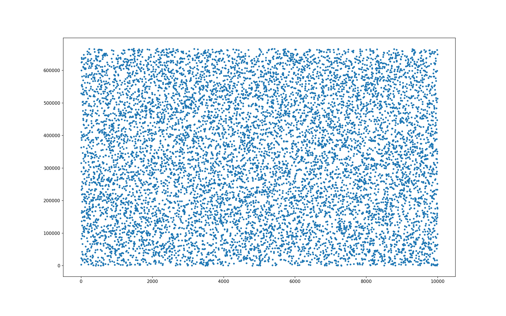

# ecl / util

## Note about random number generation in ecl

`ecl` implements the `mzran` random number generator (rng) defined here:

https://aip.scitation.org/doi/pdf/10.1063/1.168514

Checking whether a rng has been implemented correctly is hard due to the difficulty of testing for randomness.

To document the implementation, we draw 10k samples, create a plot and based on it conclude that the implementation is probably fine.

